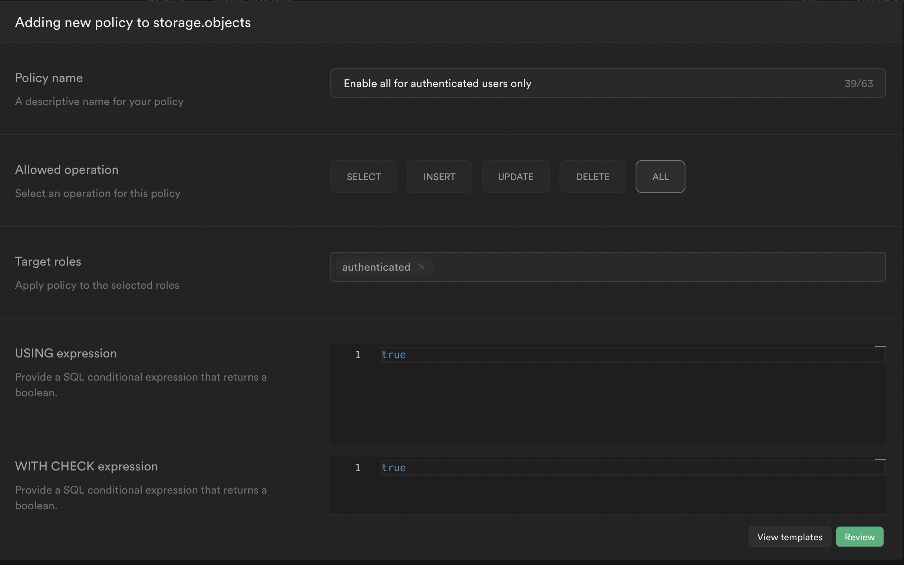

# User Profiles

The `users` auth table in supabase is not extendable or joinable, so we can't really use it to track additional user
info like name and avatar url. 

So we are going to create a `profiles` table that is auto-populated with base information when a user signs up that we
can use within our project to store additional user info and join to other tables

## SQL Schema

Fortunately for us, supabase has a starter that will add:

- Profile table
- Trigger that creates a row on sign up
- Create an storage bucket for our avatars
- Enable RLS on the table and bucket

After running the setup, you can modify the `profiles` table further to fit your needs.

**You also need to:**

- Make the bucket public
- Add the storage.objects policy

Click "Review" and "Save New Policy"

## Profile Editor

Create a page for user to edit their profile

## Redirect on No Profile

If it makes sense for our app, we can redirect to the profile page similar to how we did for no user

