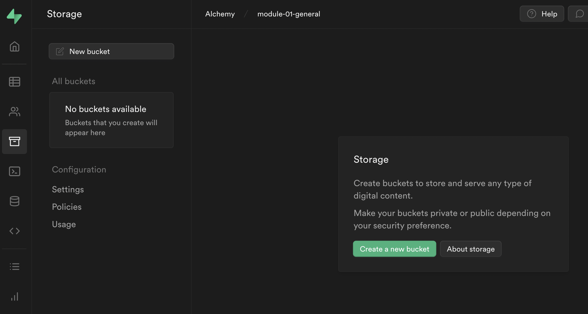
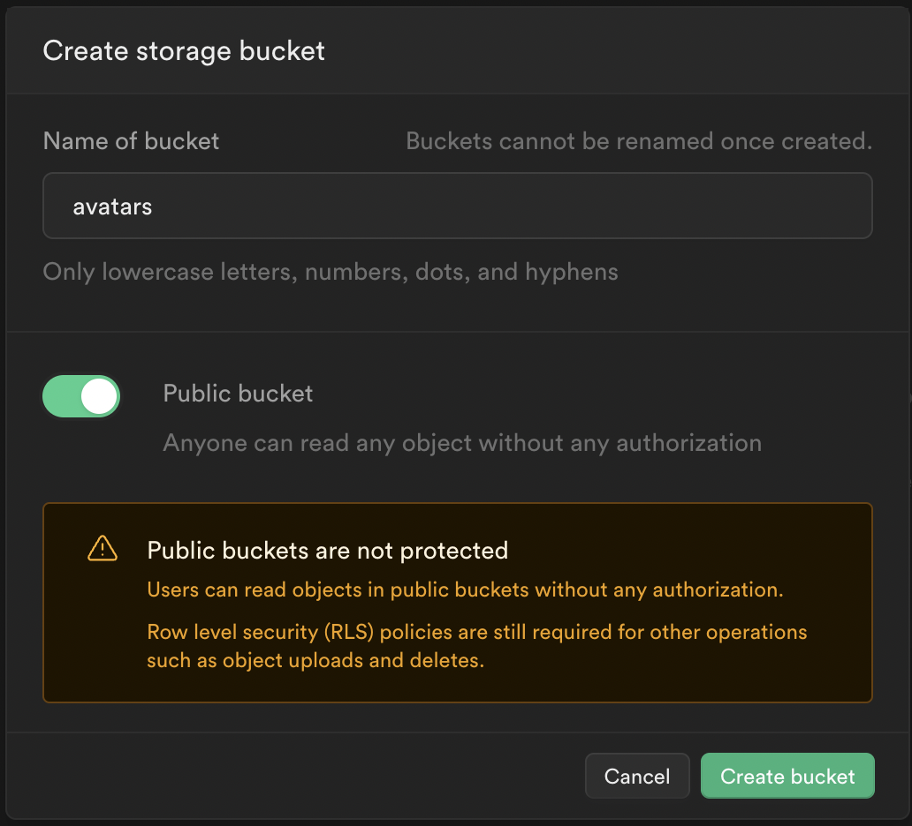
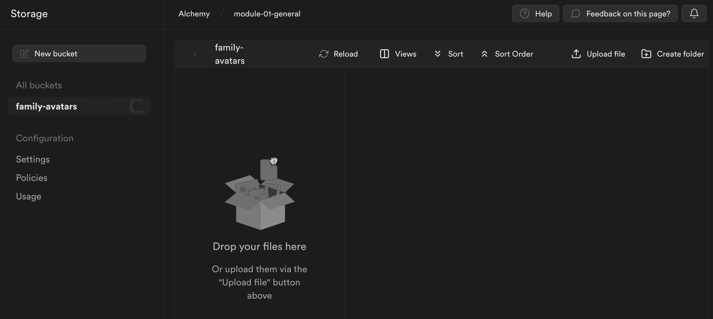
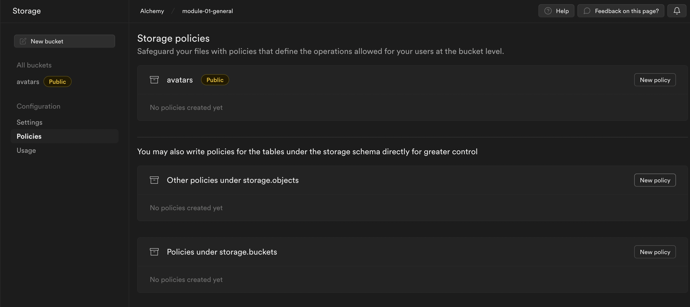
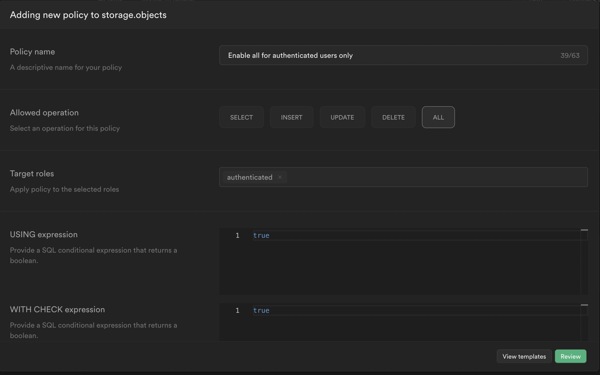

# Supabase File Storage

You can setup your supabase project to store user-uploaded images, then link to those images in your data!

## Enable Storage

Click on the "Create new bucket" button:

## Create Bucket

Use the settings below for a "public" bucket, meaning once the images are uploaded they will be accessible via a public url.

Give a name to the type of asset you want to store. You can be general like "images", or "avatars". Keep in mind you can create folders within your bucket as well as have multiple buckets! But general names tend to work well:

## Bucket Dashboard

You can add and maintain files and make folders from the dashboard. While we want to allow users to upload images, you can still perform admin tasks here and manage images.

## Bucket Policy

We need to create a policy for our bucket to enable adding new images, click on the "Policies" tab and then click "New Policy" for the second item, "Other policies under storage.objects"

Choose "For full customization" and enter the following settings for open access for any authenticated user:

Click "Review" and "Save New Policy"